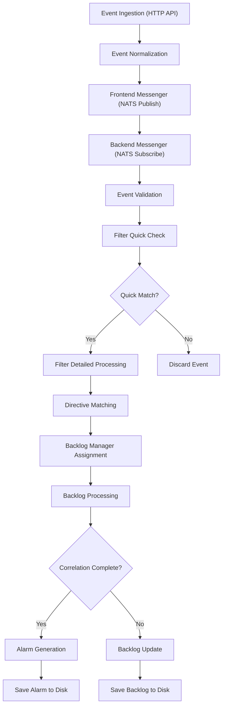

# Event Flow in `server/` (dsiem)

This document describes how an event flows through the dsiem server, highlighting the main modules, key data structures, and providing a mermaid diagram for clarity.

---

## Key Data Structures

### [`NormalizedEvent`](https://github.com/defenxor/dsiem-rs/blob/master/server/src/event.rs#L9)
The canonical representation of an event in the system. All incoming events are parsed and normalized into this struct for further processing.

Key fields:
- `id`: Unique event identifier
- `timestamp`: Event timestamp
- `sensor`: Sensor/source of the event
- `title`: Event title/description
- `src_ip`/`dst_ip`: Source and destination IP addresses
- `plugin_id`/`plugin_sid`: Plugin identifier and sub-identifier
- `product`/`category`: Product and category classification
- `src_port`/`dst_port`: Source and destination ports
- `protocol`: Network protocol
- `custom_data1-3`: Custom data fields with labels

### [`Backlog`](https://github.com/defenxor/dsiem-rs/blob/master/server/src/backlog/mod.rs#L66)
Manages event storage and retrieval for correlation and stateful detection. The backlog is used to keep track of events over time for multi-stage correlation.

Key fields:
- `id`: Unique backlog identifier
- `title`: Backlog title
- `status`: Current status
- `tag`: Associated tag
- `kingdom`/`category`: Classification
- `risk`: Calculated risk level
- `rules`: Directive rules being tracked
- `src_ips`/`dst_ips`: Source and destination IP sets
- `custom_data`: Custom data collected from events
- `intel_hits`: Threat intelligence matches
- `vulnerabilities`: Vulnerability matches

### [`Directive`](https://github.com/defenxor/dsiem-rs/blob/master/server/src/directive.rs#L19)
Represents a detection rule or logic. Directives define how events are matched, correlated, and when an alert should be triggered.

Key fields:
- `id`: Unique directive identifier
- `name`: Directive name
- `priority`: Priority level (1-5)
- `kingdom`/`category`: Classification
- `rules`: Collection of rules that define the detection logic
- `sticky_diffs`: Sticky difference tracking for unique value detection

---

## Event Flow Overview

1. **Event Ingestion**
   Events are received via HTTP API endpoints in [`server.rs`](https://github.com/defenxor/dsiem-rs/blob/master/server/src/server.rs) through the [`events_handler`](https://github.com/defenxor/dsiem-rs/blob/master/server/src/server.rs#L177).

2. **Frontend Processing**
   Events are sent to the NATS message queue via the frontend messenger in [`messenger.rs`](https://github.com/defenxor/dsiem-rs/blob/master/server/src/messenger.rs).

3. **Backend Reception**
   Events are received from NATS by the backend messenger and validated.

4. **Filtering and Quick Matching**
   Events are processed by the [`Filter`](https://github.com/defenxor/dsiem-rs/blob/master/server/src/filter.rs:63) module which performs quick checks against directive rules.

5. **Directive Matching**
   Events are matched against loaded [`Directive`](https://github.com/defenxor/dsiem-rs/blob/master/server/src/directive.rs#L19) rules for correlation.

6. **Backlog Management**
   Events are processed by backlog managers which track multi-stage correlation.

7. **Alert Generation**
   When correlation conditions are met, alarms are generated and saved to disk.

---

## Detailed Event Flow

### Step-by-Step Flow

1. **Event Ingestion**
   - Events are received via HTTP POST to `/events` endpoint in [`server.rs`](https://github.com/defenxor/dsiem-rs/blob/master/server/src/server.rs#L177)
   - Multiple events can be sent in a single request as an array

2. **Normalization**
   - Events are parsed from JSON into [`NormalizedEvent`](https://github.com/defenxor/dsiem-rs/blob/master/server/src/event.rs#L9) structure
   - Event validation is performed to ensure required fields are present

3. **Frontend Messenger**
   - Valid events are sent to NATS message queue via [`messenger.rs`](https://github.com/defenxor/dsiem-rs/blob/master/server/src/messenger.rs#L110)
   - Events are published to the `dsiem_events` subject

4. **Backend Reception**
   - Backend subscribes to `dsiem_events` subject in [`messenger.rs`](https://github.com/defenxor/dsiem-rs/blob/master/server/src/messenger.rs#L130)
   - Events are received and validated against asset whitelists
   - Valid events are sent to the filtering pipeline

5. **Filtering**
   - Events are processed by multiple filter threads in [`filter.rs`](https://github.com/defenxor/dsiem-rs/blob/master/server/src/filter.rs#L118)
   - Quick check cache is used to filter out events that don't match any directive rules
   - Events that pass quick check are matched against specific directives

6. **Directive Matching**
   - Filtered events are sent to appropriate backlog managers based on directive ID
   - Each backlog manager handles events for a specific directive

7. **Backlog Processing**
   - Events are processed by [`Backlog`](https://github.com/defenxor/dsiem-rs/blob/master/server/src/backlog/mod.rs#L66) instances in [`backlog/mod.rs`](https://github.com/defenxor/dsiem-rs/blob/master/server/src/backlog/mod.rs#L507)
   - Events are matched against directive rules and correlation logic
   - Multi-stage correlation tracks events across multiple rule stages

8. **Alarm Generation**
   - When correlation conditions are met, alarms are generated
   - Alarms are saved to disk via the log writer in [`log_writer.rs`](https://github.com/defenxor/dsiem-rs/blob/master/server/src/log_writer.rs)

---

## Module Roles

### [`server.rs`](https://github.com/defenxor/dsiem-rs/blob/master/server/src/server.rs)
Exposes HTTP endpoints for event ingestion and configuration management.

Key functions:
- [`events_handler`](https://github.com/defenxor/dsiem-rs/blob/master/server/src/server.rs#L177): Handles incoming events via HTTP POST
- [`config_*_handler`](https://github.com/defenxor/dsiem-rs/blob/master/server/src/server.rs#L78): Handles configuration management

### [`messenger.rs`](https://github.com/defenxor/dsiem-rs/blob/master/server/src/messenger.rs)
Handles message queue (NATS) integration for event distribution between frontend and backend.

Key functions:
- [`frontend_start`](https://github.com/defenxor/dsiem-rs/blob/master/server/src/messenger.rs#L79): Publishes events to NATS
- [`backend_start`](https://github.com/defenxor/dsiem-rs/blob/master/server/src/messenger.rs#L124): Subscribes to events from NATS
- [`handle_event_message`](https://github.com/defenxor/dsiem-rs/blob/master/server/src/messenger.rs#L191): Processes received events

### [`event.rs`](https://github.com/defenxor/dsiem-rs/blob/master/server/src/event.rs)
Defines the normalized event structure and validation logic.

Key functions:
- [`NormalizedEvent`](https://github.com/defenxor/dsiem-rs/blob/master/server/src/event.rs#L9): Main event structure
- [`valid`](https://github.com/defenxor/dsiem-rs/blob/master/server/src/event.rs#L91): Event validation logic

### [`filter.rs`](https://github.com/defenxor/dsiem-rs/blob/master/server/src/filter.rs)
Implements the main event processing pipeline, applying directives and managing event flow.

Key functions:
- [`Filter`](https://github.com/defenxor/dsiem-rs/blob/master/server/src/filter.rs#L59): Main filter structure
- [`event_handler`](https://github.com/defenxor/dsiem-rs/blob/master/server/src/filter.rs#L118): Processes events in filter threads
- [`FilterTarget`](https://github.com/defenxor/dsiem-rs/blob/master/server/src/filter.rs#L32): Represents a directive target for filtering

### [`backlog`](https://github.com/defenxor/dsiem-rs/blob/master/server/src/backlog/)
Stores events for correlation and stateful detection.

Key modules:
- [`mod.rs`](https://github.com/defenxor/dsiem-rs/blob/master/server/src/backlog/mod.rs): Main backlog implementation
- [`manager.rs`](https://github.com/defenxor/dsiem-rs/blob/master/server/src/backlog/manager.rs): Backlog manager implementation
- [`spawner.rs`](https://github.com/defenxor/dsiem-rs/blob/master/server/src/backlog/manager/spawner.rs): Backlog manager spawner

Key functions:
- [`Backlog`](https://github.com/defenxor/dsiem-rs/blob/master/server/src/backlog/mod.rs#L66): Main backlog structure
- [`process_new_event`](https://github.com/defenxor/dsiem-rs/blob/master/server/src/backlog/mod.rs#L507): Processes new events in backlogs
- [`BacklogManager`](https://github.com/defenxor/dsiem-rs/blob/master/server/src/backlog/manager.rs#L55): Manages backlogs for a directive

### [`directive.rs`](https://github.com/defenxor/dsiem-rs/blob/master/server/src/directive.rs)
Loads and validates detection rules.

Key functions:
- [`Directive`](https://github.com/defenxor/dsiem-rs/blob/master/server/src/directive.rs#L19): Main directive structure
- [`load_directives`](https://github.com/defenxor/dsiem-rs/blob/master/server/src/directive.rs#L187): Loads directives from configuration files
- [`DirectiveRule`](https://github.com/defenxor/dsiem-rs/blob/master/server/src/rule.rs#L54): Individual rule within a directive

### [`rule.rs`](https://github.com/defenxor/dsiem-rs/blob/master/server/src/rule.rs)
Implements rule matching logic for event correlation.

Key functions:
- [`DirectiveRule`](https://github.com/defenxor/dsiem-rs/blob/master/server/src/rule.rs#L54): Individual rule implementation
- [`does_event_match`](https://github.com/defenxor/dsiem-rs/blob/master/server/src/rule.rs#L154): Checks if an event matches a rule
- [`quick_check_plugin_rule`](https://github.com/defenxor/dsiem-rs/blob/master/server/src/rule.rs#L577): Quick plugin rule matching
- [`quick_check_taxo_rule`](https://github.com/defenxor/dsiem-rs/blob/master/server/src/rule.rs#L570): Quick taxonomy rule matching

---

## Performance Considerations

### Threading Model
- Multiple filter threads process events in parallel
- Backlog managers run in separate tokio tasks
- NATS message queue provides asynchronous event distribution

### Memory Management
- Events are processed in bounded queues to prevent memory exhaustion
- Backlogs are saved to disk when inactive to reduce memory usage
- Lazy loading of directives reduces startup memory footprint

### Caching
- Quick check caches filter out events that don't match any rules
- Intel and vulnerability lookups are cached to reduce external API calls
- Directive rule pairs are precomputed for fast matching

---

## Summary

The dsiem server processes events by:
1. Receiving events via HTTP API
2. Normalizing events into a standard format
3. Distributing events via NATS message queue
4. Filtering events against directive rules
5. Correlating events across multiple stages using backlogs
6. Generating alerts when correlation conditions are met
7. Saving alerts and backlogs to disk for persistence

The modular design allows for efficient event-driven detection with support for complex multi-stage correlation rules.