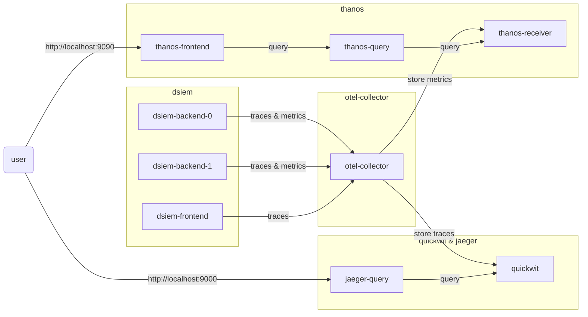

# Telemetry

Dsiem-rs can export traces and metrics to [OpenTelemetry](https://opentelemetry.io/) collector, which can then send those data to monitoring platform such as [Jaeger](https://www.jaegertracing.io/) and [Prometheus](https://prometheus.io/)/[Thanos](https://thanos.io/).

Example configuration is available from this [docker-compose](../deployments/docker/docker-compose-telemetry.yml) file. That setup produces this architecture:



>[!NOTE]
>The example Docker compose environment doesn't store quickwit and thanos data to a volume, so they will start from zero every time the environment restarts. Consult each project's documentation on how to setup permanent storage if needed.

## Traces

Traces follow events as they travel from frontend to backends and get processed by all directives. Below is a view of Jaeger UI showing an event being processed by 2 backends each having 1 and 3 directives. The UI makes it easy to locate specific item of interest, which in this case is `directive.id=3` (result is highlighted in yellow).


>[!NOTE]
>To see log events in traces as shown above, make sure to set `DSIEM_DEBUG` or `DSIEM_TRACE` to `true`. There's no difference between logs in traces and terminal console (stdout), both are controlled by the same environment variables or startup flags.

## Metrics

Measurement is done for the following metrics:

- `eps` : The rate of events/second processed by Dsiem.

- `queue_length`: Total current events backend's receive queue, waiting to be processed.

- `directives_ttl`: Total number of directives assigned to the backend node. This is only checked at startup and never changes afterwards.

- `directives_active`: Total number of directives that are actively having a backlog.

- `events_rcvd`: The number of events received by a backend node _since the last measurement_. Measurement is done every 10s, and this counter will reset back to 0 after that. The purpose is to be able to detect connectivity issues between the node and NATS.

- `events_matched`: The number of events matching any directive _since the last measurement_, so this will also reset every 10s. Together with `directives_active`, this can help evaluate the effectiveness of current directive assignment in multiple backend nodes scenario.

- `backlogs`: The number of backlogs currently active on the system.

- `backlogs_timedout`: The number of backlogs that are not processing event fast enough to sustain the EPS set in `max_eps`. This doesn't mean that these backlogs are currently dropping or skipping events. Events will likely be skipped only if incoming matching events to those backlogs in the future consistently hit the `max_eps` rate.

- `avg_proc_time_ms`: Average backlog's processing time for a single event, in milliseconds. This resets to 0 together with `matched_events` if there is no matching events since the previous measurement.


Here's an example of Thanos frontend displaying the graph of `avg_proc_time_ms`. Prefix `dsiem_` is added to all metrics for easier search experience.  Prometheus supports advanced queries and can be set to send alerts when a certain baseline/threshold is breached.


Dsiem also prints those measurements regularly to console (stdout). You can use `grep` to filter for `dsiem::watchdog`, or as shown below with `jq` if Json log format is enabled:

```shell
docker logs -f dsiem-backend-0 --since=10s | jq -c --unbuffered '. | select(.target=="dsiem::watchdog")'

{"timestamp":"2024-03-26T04:44:50.978559Z","level":"INFO","fields":{"message":"watchdog report","eps":7530.67,"queue_length":0,"avg_proc_time_ms":0.006,"directives_ttl":23691,"directives_active":42,"events_rcvd":45495,"events_matched":755,"backlogs":42,"backlogs_timedout":0},"target":"dsiem::watchdog"}
{"timestamp":"2024-03-26T04:45:00.983794Z","level":"INFO","fields":{"message":"watchdog report","eps":8162,"queue_length":3756,"avg_proc_time_ms":0.006,"directives_ttl":23691,"directives_active":92,"events_rcvd":77216,"events_matched":46236,"backlogs":92,"backlogs_timedout":0},"target":"dsiem::watchdog"}
{"timestamp":"2024-03-26T04:45:10.978341Z","level":"INFO","fields":{"message":"watchdog report","eps":8715.45,"queue_length":0,"avg_proc_time_ms":0.006,"directives_ttl":23691,"directives_active":179,"events_rcvd":93054,"events_matched":73007,"backlogs":179,"backlogs_timedout":0},"target":"dsiem::watchdog"}
{"timestamp":"2024-03-26T04:45:20.977917Z","level":"INFO","fields":{"message":"watchdog report","eps":8317.48,"queue_length":0,"avg_proc_time_ms":0.006,"directives_ttl":23691,"directives_active":282,"events_rcvd":84219,"events_matched":97003,"backlogs":282,"backlogs_timedout":1},"target":"dsiem::watchdog"}
```