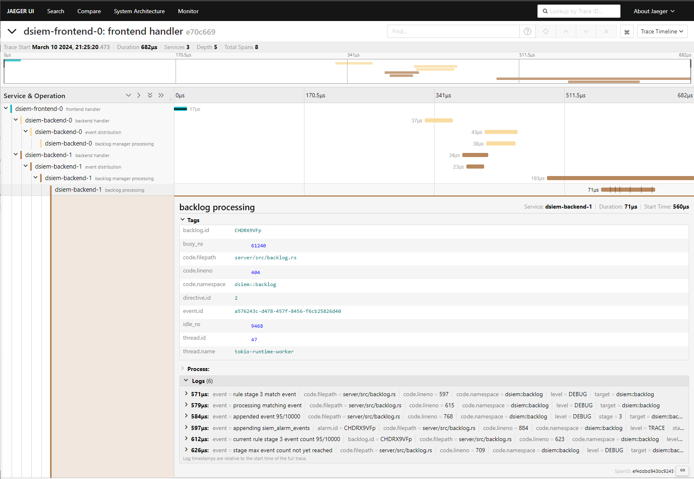

# Telemetry

Dsiem-rs can export traces and metrics to [OpenTelemetry](https://opentelemetry.io/) collector, which can then send those data to monitoring platform such as [Jaeger](https://www.jaegertracing.io/) and [Prometheus](https://prometheus.io/)/[Thanos](https://thanos.io/).

Example configuration is available from this [docker-compose](../deployments/docker/docker-compose-telemetry.yml) file. That setup produces this architecture:


>[!NOTE]
>The example Docker compose environment doesn't store quickwit and thanos data to a volume, so they will start from zero every time the environment restarts. Consult each project's documentation on how to setup permanent storage if needed.

## Traces

Traces follow events as they travel from frontend to backends and get processed by all directives. Below is a view of Jaeger UI showing an event being processed by 2 backends each having 1 and 3 directives. The UI makes it easy to locate specific item of interest, which in this case is `directive.id=3` (result is highlighted in yellow).



>[!NOTE]
>To see log events in traces as shown above, make sure to set `DSIEM_DEBUG` or `DSIEM_TRACE` to `true`. There's no difference between logs in traces and terminal console (stdout), both are controlled by the same environment variables or startup flags.

## Metrics

Measurement is done for the following metrics:

- `eps` : The rate of events/second processed by Dsiem.

- `ttl_directives`: Total number of directives that are loaded and will receive events.

- `active_directives`: Total number of directives that are actively having a backlog.

- `backlogs`: The number of backlogs active on the system.

- `avg_proc_time_ms`: Average backlog's processing time for a single event, in milliseconds.

- `queue_length`: Total events in queue, waiting for directive manager to pickup.

Here's an example of Thanos frontend displaying the graph of `avg_proc_time_ms`. Prefix `dsiem_` is added to all metrics for easier search experience.  Prometheus supports advanced queries and can be set to send alerts when a certain baseline/threshold is breached.


Dsiem also prints those measurements regularly to console (stdout). You can use `grep` to filter for `dsiem::watchdog`, or as shown below with `jq` if Json log format is enabled:

```shell
docker logs -f dsiem-backend-0 --since=10s | jq -c --unbuffered '. | select(.target=="dsiem::watchdog")' 

{"timestamp":"2024-02-22T12:05:41.047164Z","level":"INFO","fields":{"message":"watchdog report","eps":3.12,"queue_length":0,"avg_proc_time_ms":0.003,"ttl_directives":3,"active_directives":3,"backlogs":3},"target":"dsiem::watchdog"}
{"timestamp":"2024-02-22T12:05:51.046974Z","level":"INFO","fields":{"message":"watchdog report","eps":3.12,"queue_length":0,"avg_proc_time_ms":0.003,"ttl_directives":3,"active_directives":3,"backlogs":3},"target":"dsiem::watchdog"}
{"timestamp":"2024-02-22T12:06:01.047316Z","level":"INFO","fields":{"message":"watchdog report","eps":3.12,"queue_length":0,"avg_proc_time_ms":0.003,"ttl_directives":3,"active_directives":3,"backlogs":3},"target":"dsiem::watchdog"}
{"timestamp":"2024-02-22T12:06:11.047128Z","level":"INFO","fields":{"message":"watchdog report","eps":3.11,"queue_length":0,"avg_proc_time_ms":0.003,"ttl_directives":3,"active_directives":3,"backlogs":3},"target":"dsiem::watchdog"}
```