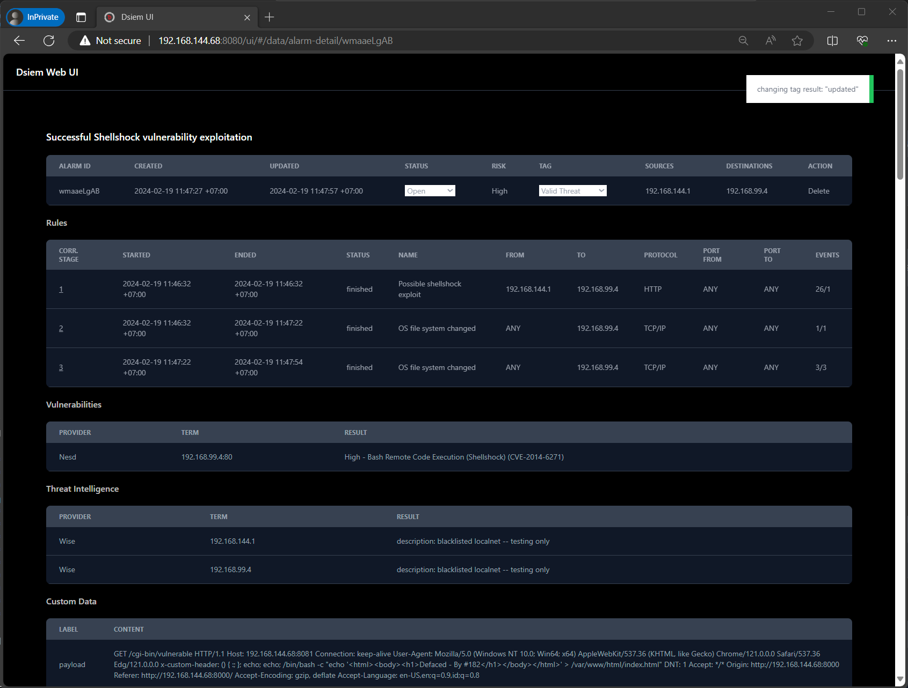

# Web Interfaces

Dsiem comes with an example Kibana dashboard ready for import, and a web UI for deleting and managing alarms status and tag.

## Kibana Dashboard

Dsiem's example Kibana dashboard can be imported using the step provided [here](./installation.md#importing-kibana-dashboard). The result should be similar to this:

The dashboard also provide a URL link (through Kibana scripted field) called `Dsiem Link` that will open each alarm on Dsiem web UI.

## Dsiem Web UI

The web UI home page is accessible from http://dsiem-address:8080/ui/. Normally you will access this app by clicking on specific alarm `Dsiem Link` from Kibana dashboard.

From the alarm page above, you can interact with the following cell:
* **Status**: to change the alarm Status from `Open` to `In-Progress` or `Closed`.
* **Tag**: to change the alarm's tag from `Identified Threat` to `False Positive`, `Valid Threat`, or `Security Incident`.
* **Delete**: to delete the alarm and its associated links from Elasticsearch.

>[!TIPS]
>The above statuses and tags can be customized by supplying the appropriate dsiem [startup parameter](./commands.md).

